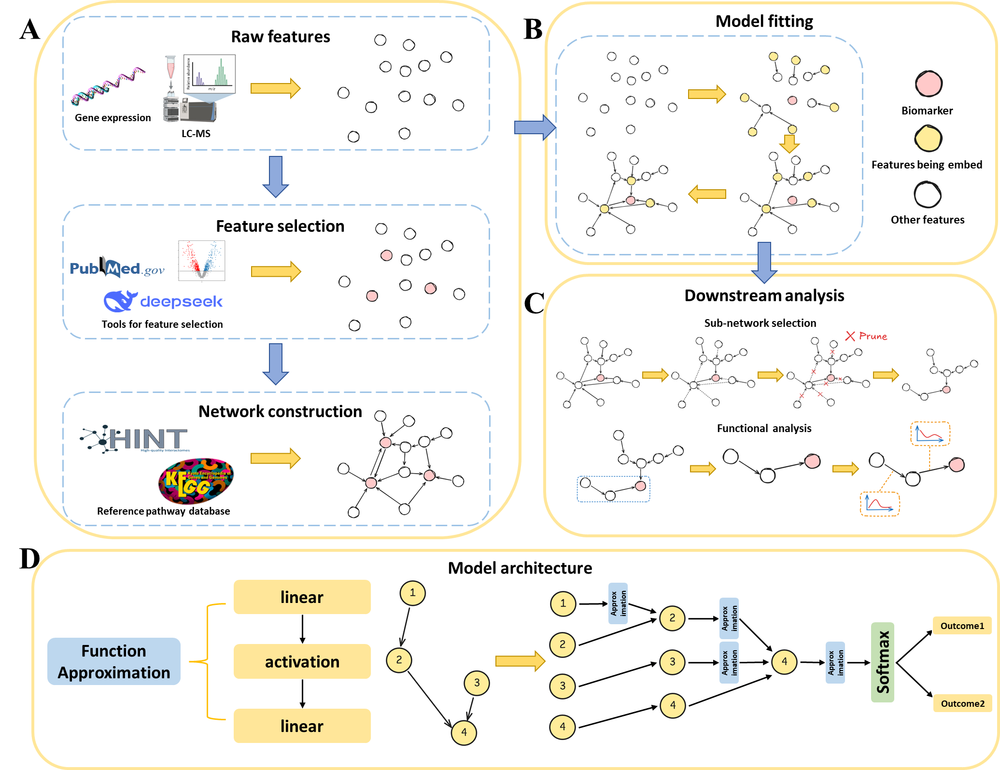
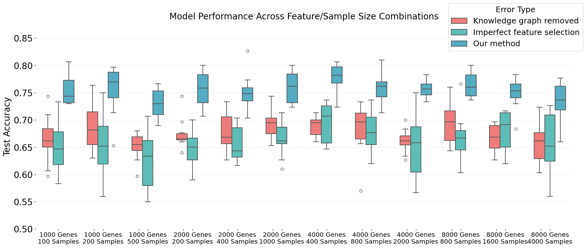

# PathNet

PathNet is a knowledge-informed neural network framework for tabular omics data.
It uses user-selected centric features and a pathway or interaction graph to
build a sparse, pathway-constrained network. The goal is to keep predictive
performance while making the learned model easier to inspect at the pathway and
edge level.

PathNet is not a causal-discovery method. The supplied graph is used as a
topological prior for model construction and interpretation.

## Overview



The package supports two common settings:

- metabolomics data, where LC-MS features can be matched to KEGG metabolites;
- gene and miRNA expression data, where a user-supplied interaction graph can
  constrain the hidden layers.

The repository also contains the controlled simulation example used to evaluate
whether the known graph can recover a designed signal.



## Repository Contents

```text
PathNet/
  model.py                 # PathNet model classes and sparse training helper
  utils.py                 # data preprocessing and knowledge-graph loading
  data/
    graph.graphhml         # default KEGG-derived graph
    kegg.txt.zip           # compressed KEGG/adduct table, extracted on import
example_meta.ipynb         # metabolomics workflow example
example_gene.ipynb         # gene/miRNA workflow example
docs/figures/              # representative manuscript figures
```

`PathNet/data/kegg.txt.zip` is kept compressed to keep the repository smaller.
When `PathNet` is imported, the archive is extracted to `PathNet/data/kegg.txt`
if needed. The extracted text file is ignored by git.

## Installation

Clone the repository and install the scientific Python dependencies in your
preferred environment:

```bash
git clone https://github.com/YanLarryKE/PathNet.git
cd PathNet
pip install numpy pandas scipy scikit-learn torch python-igraph
```

The notebooks were developed in a standard Jupyter environment.

## Quick Start

```python
import pandas as pd
from PathNet import data_preprocessing, load_knowledge_graph, sparse_nn

# Load the default graph bundled with PathNet.
graph = load_knowledge_graph()

# For metabolomics, provide positive/negative mode feature tables.
pos = pd.read_csv("data/data_processed/pos_processed.csv", index_col=0)
neg = pd.read_csv("data/data_processed/neg_processed.csv", index_col=0)

data_annos, matching, sub_graph, metabolites, matches = data_preprocessing(
    pos=pos,
    neg=neg,
    idx_feature=4,
    match_tol_ppm=9,
    zero_threshold=0.75,
)
```

For end-to-end examples, see:

- `example_meta.ipynb`
- `example_gene.ipynb`

The example notebooks reference processed data generated for the manuscript
analyses. Large raw and processed omics matrices are not bundled in this code
repository; prepare them following the notebook format before running the full
examples.

## Custom Knowledge Graphs

PathNet can load either an `igraph.Graph`, the bundled GraphML/GraphHML file, or
a simple edge-list file:

```python
from PathNet import load_knowledge_graph

custom_graph = load_knowledge_graph(
    graph_path="my_edges.tsv",
    sep="\t",
    source_col="source",
    target_col="target",
    header=0,
)
```

The current implementation treats the graph as an undirected topological prior
for model construction by default. Directed information can still be retained in
the source graph for interpretation outside the feed-forward model.

## Notes

- Centric-feature selection is part of the modeling design. Poorly chosen
  centric features or an inaccurate prior graph can reduce interpretability and
  may also affect predictive performance.
- The retained network should be interpreted as knowledge-guided model structure
  and attribution support, not as proof of causal relationships.
- The notebooks are analysis examples rather than a polished command-line
  interface. The public API is currently centered on `data_preprocessing`,
  `load_knowledge_graph`, and `sparse_nn`.
